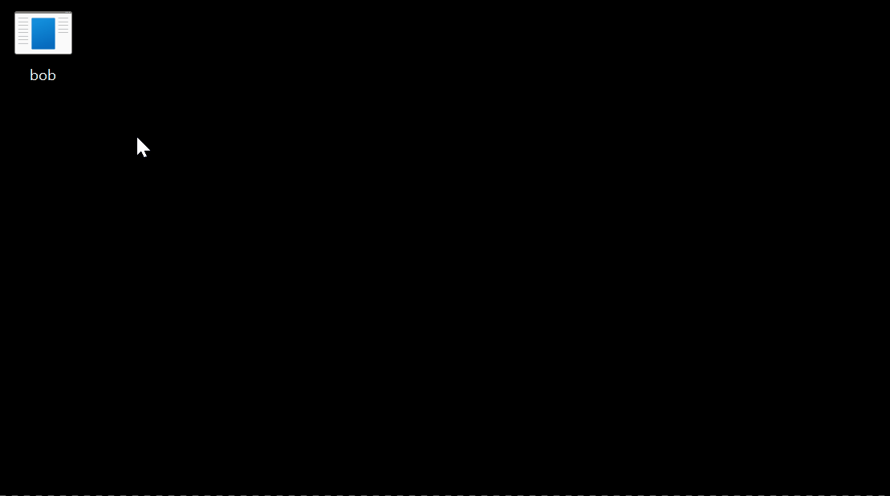

<h1 align="center">B·o·B</h1>
<h4 align="center">A peer-to-peer file-transfer in OCaml</h4>
<hr>

**Work In Progress**: This repository just help me to save my work. The project
is under an active development and it still is experimental. For more
information, you can take a look on [spoke][spoke] and an [article][article]
which describe its implementation first. Then, enjoy to read GADTs and
comments...

Bob is a **simple**, **secure** and **universal** program for transmitting a
file or a folder from one person to another. The aim of bob is to offer the
possibility to share documents without any constraints:
- security
- accesibility: we mainly want to provide one binary which works anywhere
- usage

The software is available here: [bob.com][bob-com]. You can use it directly
without any installation! You can check how we built `bob.com` via our
website: [builds.osau.re](https://builds.osau.re)

For this purpose, bob uses [state-of-the-art][article] security,
[Cosmopolitan][cosmopolitan] to ensure its accessibility on all systems and a
simplicity that only meets the objective of transmitting a document.

### A simple example

#### On Windows,

This is a simple animation of how to use `bob.com` on Windows:
<div align="center">
How to send a file:<br />


How to receive a file (with the same password):<br />

</div>

#### On other platforms,

You can compile & install bob with [opam][opam]:
```sh
$ opam pin add -y https://github.com/dinosaure/bob
```

Bob has 3 sub-programs, the receiver, the sender and the relay. We will
concentrate on the first two:
- `bob recv` requires a password (decided between you and the sender). Take for
  example: revolucion-para-siempre. This program has several options like
  accepting any sender (sharing the same password) automatically or the address
  of the relay. An example of its use is:
```sh
$ bob recv revolucion-para-siempre -r $(dig +short osau.re) -y
>>> Received a file: my_huge_file.txt.
>>> ⠼   13.5 MiB    2.2 MiB/s
```
- `bob send` requires a document (a file or a folder) and let you to specify
  few options: compression, password, relay address.
```sh
$ bob send --password revolucion-para-siempre -r $(dig +short osau.re) \
    --no-compression my_huge_file.txt
>>> [│████████████████████████████│]   13.5 MiB  / 13.54 MiB
```

As you can see, some information is displayed and the download can begin. You
can let bob decide on the password if you want with regard to the sender:
```sh
$ bob send -r $(dig +short osau.re) my_huge_file.txt
Password: wei-widwagamboostu
>>> [│                            │]    0.0 B    / 13.54 MiB
```

And, by default, we always ask for confirmation from the recipients as to what
he/she is receiving:
```sh
$ bob recv -r $(dig +short osau.re) wei-widwagamboostu
Accept from 213.245.183.59:55291 [Y/n]:
```

### Design, Protocol and Implementation

If you are interested in the implementation of bob, the protocol itself or the
design of the program in general, there are some notes on this in the
distribution. For future contributions, it is advisable to read these
documents.

### Avantage of `bob`

#### The relay implementation

One of the advantage of `bob` is the implementation of its relay, which simply
transfers information from one peer to another without altering the content.
The investigators of the agreement are **only** the peers and the relay does
not intervene **in any way** in this agreement. The sole role of the relay is
to transfer information from one peer to another. When two peers reach an
agreement, they notif the relay so that it can allocate a secure channel
between the two peers.

The relay is therefore _blind_ to the algorithm used to reach an agreement.
This feature ensures that there is no compromise between peers via the relay.

The protocol itself does not allow the relay to obtain enough information to
decrypt your communications. Indeed, the initial exchange (the _handshake_)
between the peers is an exchange that could be done without a relay. The
purpose of the relay is:
- to provide a stable connection
- allow two peers to communicate with each other when they cannot directly
  (certainly because of a proxy)

The only packet that the relay introspects is that of the receiver's refusal or
acceptance in order to allocate a secure communication channel for the two
peers.

#### OCaml & GADTs

The state machine defined to ensure the exchange uses an feature of the OCaml
language: GADTs. From this we can encode at type level that a client cannot
talk to another client and a server cannot talk to another server. In this way,
we can prune problematic cases as errors upstream, outside the implementation
of the so-called state machine.

Indeed, the implementation of the state machine utimately focuses only on valid
cases - namely, a receiver wanting to communicate with a sender and vice-versa.
This property (the duality between receiver and sender) can be _encoded_ with
types and GADTs.

```ocaml
type send = | and recv = | and relay = |

type ('a, 'b) peer =
  | Send : (send, recv) peer
  | Recv : (recv, send) peer

type ('from, 'to) src =
  | Relay : (relay, 'to) src
  | Peer  : ('from, 'non_from) peer -> ('from, 'non_from) src

type ('from, 'to) dst =
  | Relay : ('from, relay) dst
  | Peer  : ('to, 'non_to) peer -> ('non_to, 'to) dst

type ('from, 'to) packet =
  | Hello_as_a_client : (recv, relay) packet
  | Hello_as_a_server : (send, relay) packet
  | Client_validator  : (recv,  send) packet
  | Server_validator  : (send,  recv) packet
```

This does not mean that we cannot receive a packet from a sender to a sender,
but we can (and should) elimimate such cases upstream of the state machine.
Another property is that we cannot, in OCaml and in this state machine,
explicitely send a packet to a sender if we are recognizsed as a sender.

#### Unikernels and [MirageOS][mirage]

Bob provides 2 implementations of the relay which are very similar. One is a
part of the executable and the user can launch its own relay _via_ `bob relay`
and an other implementation exists as an unikernel (see [mirage/][./mirage]).

The last one lets the user compile a full operating system as a relay and
virtualize it with KVM for instance. You must have a machine with [KVM][kvm].
You must install the `mirage` tool and install `bob` first. Then, you should be
able to craft the operating system with:
```sh
$ opam install mirage
$ git clone https://github.com/dinosaure/bob
$ mkdir bob-unikernel
$ cp bob/mirage/* bob-unikernel/
$ cd bob-unikernel/
$ mirage configure -t hvt
$ make depends
$ mirage build
$ ls dist/bob.hvt
dist/bob.hvt
```

An image `bob.hvt` is crafted and it can be launched with [Solo5][solo5] and
[albatross][albatross]. Albatross is available _via_ `apt` if you want:
```sh
$ wget -q -O - https://apt.robur.coop/gpg.pub | apt-key add -
$ echo "deb https://apt.robur.coop ubuntu-20.04 main" >> /etc/apt/sources.list
$ sudo apt update
$ sudo apt install solo5-hvt albatross
```

##### Networks and unikernels

For OS virtualization, you usually requires a bridge:
```
$ cat >>/etc/network/interfaces <<EOF

auto service
iface service inet static
  address 10.0.0.1
  netmask 255.255.255.0
  broadcast 10.0.0.255
  bridge_ports none
  bridge_stp off
  bridge_fd 0
  bridge_maxwait 0
EOF
$ systemctl restart networking
```

Finally, you need to let the unikernel to communicate with Internet and let
people to communicate with your unikernel:
```sh
$ cat "1" > /proc/sys/net/ipv4/ip_forward
$ iptables -A FORWARD -o service -m conntrack --ctstate RELATED,ESTABLISHED \
    -j ACCEPT
$ iptables -A FORWARD -i service ! -o service -j ACCEPT
$ iptables -A FORWARD -i service -o service -j ACCEPT
$ iptables -t nat -A POSTROUTING -s 10.0.0.0/24 ! -o service \
    -j MASQUERADE
$ iptables -N BOB
$ iptables -A BOB -d 10.0.0.2/32 ! -i service -o service \
    -p tcp -m tcp --dport 9000 -j ACCEPT
$ iptables -A BOB -d 10.0.0.2/32 ! -i service -o service \
    -p tcp -m tcp --dport 9001 -j ACCEPT
$ iptables -A FORWARD -o service -j BOB
$ iptables -t nat -N BOB
$ iptables -t nat -A PREROUTING -m addrtype --dst-type LOCAL -j BOB
$ iptables -t nat -A BOB ! -s 10.0.0.2/32 \
    -p tcp -m tcp --dport 9000 =j DNAT --to-destination 10.0.0.2:9000
$ iptables -t nat -A BOB ! -s 10.0.0.2/32 \
    -p tcp -m tcp --dport 9001 =j DNAT --to-destination 10.0.0.2:9000
```

##### Launch the unikernel

You can launch the unikernel with `albatross` with:
```sh
$ albatross-client-local create --net=service \
    --arg="--ipv4=10.0.0.2/24"
    --arg="--ipv4-gateway=10.0.0.1" bob bob.hvt
```

Locally, you are able to communicate with your relay _via_ the `-r` option:
```sh
$ bob send -r <my-public-ip>:9000
Password: shoacquis-feursonsindlebu

$ bob -r <my-public-ip>:9000 shoacquis-feursonsindlebu
Accept from <server-identity> [Y/n]: Y
Handshake is done with <server-identity>
```

#### Reproducible builds

The version you can download of `bob.com` was produced in such a context that
you can reproduce the same binary in the same context. This is called software
reproducibility. We provide an infrastructure (developed by [robur.io][robur])
[builds.osau.re](https://builds.osau.re) that checks the reproducibility of the
software every day.

#### [Esperanto][esperanto], [Cosmopolitan][cosmopolitan] and Windows support

Currently, the `bob` executable can be compiled with the `esperanto` toolchain.
By this way, we are able to deliver a `bob.com` which works _anywhere_. The
status of it is experimental. However, few tweak on some libraries (specially
`mirage-crypto` and `digestif`) are needed to be able to compile `bob`
with this _toolchain_.

The final executable, the `bob.com` seems to work on PowerShell (Windows) and
obviously Linux.

A CI exists which try to compile `bob` with Esperanto and Cosmopolitan. The
builded artifact is available into the GitHub action which built the
executable. Any users can download this artifact (see Actions and the last
green GitHub Action, you will find a `bob.com` artifact) and execute it on
their computer - there should be no prerequisites.

[spoke]: https://github.com/dinosaure/spoke
[article]: https://blog.osau.re/articles/spoke.html
[mirage]: https://mirage.io/
[kvm]: https://en.wikipedia.org/wiki/Kernel-based_Virtual_Machine
[solo5]: https://github.com/Solo5/solo5
[albatross]: https://github.com/hannesm/albatross
[esperanto]: https://github.com/dinosaure/esperanto
[cosmopolitan]: https://github.com/jart/cosmopolitan
[opam]: https://opam.ocaml.org/
[robur]: https://robur.io/
[bob-com]: https://builds.osau.re/job/bob/build/latest/f/bin/bob.com
